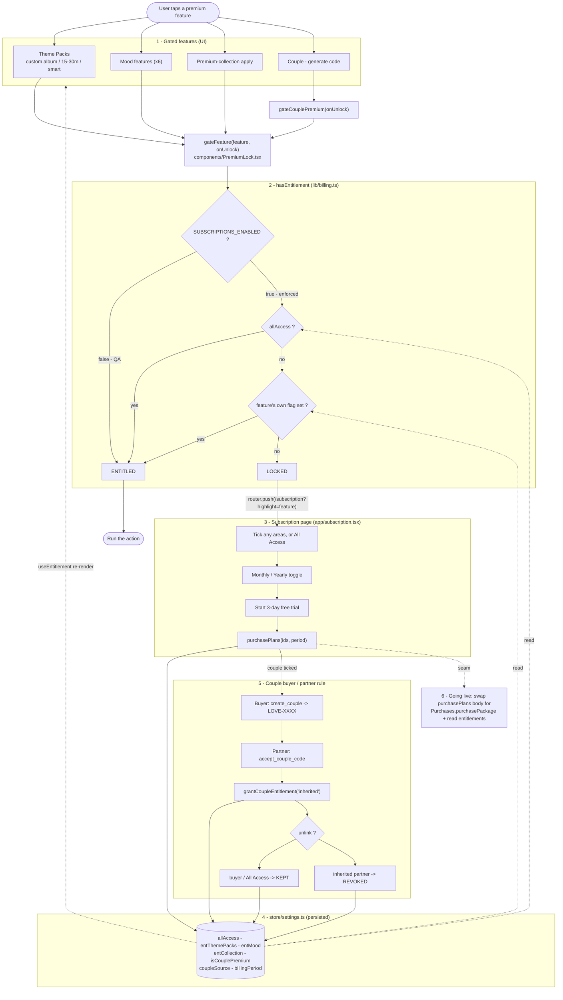
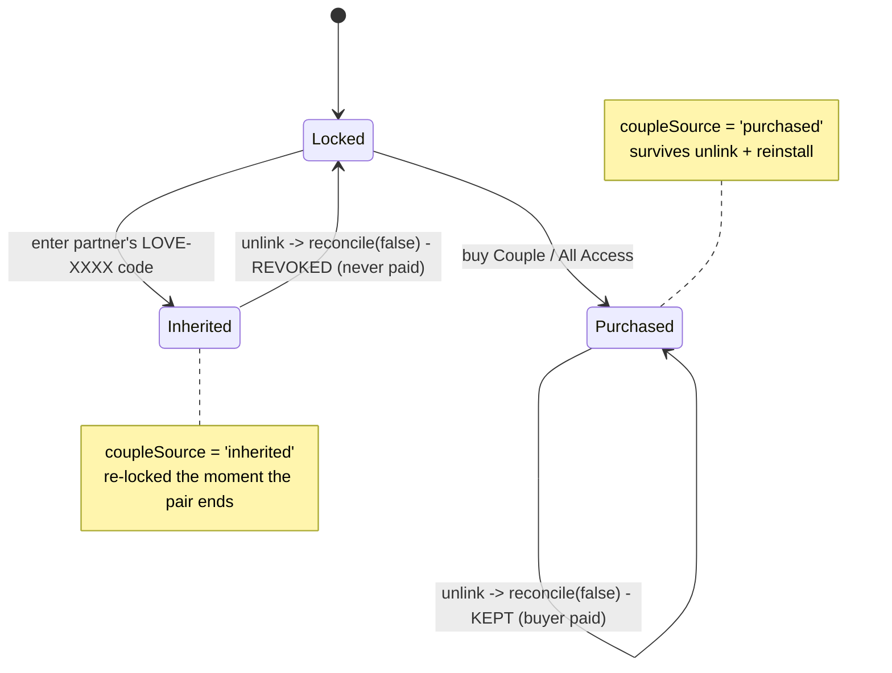
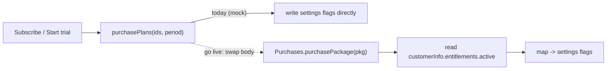

# Subscription — Summary, Rules & Diagram

The single reference for how the paywall works in Kawaii Baby Wallpapers.
(Consolidates the earlier architecture / diagrams / market-research docs.)

---

## Summary

- **Four premium areas, sold à la carte, plus an All Access bundle.** Each maps
  to one persisted flag.
- **Billing: Monthly or Yearly**, with a **3-day free trial → then paid**.
- **Publishing mode is ON** (`SUBSCRIPTIONS_ENABLED = true`) — gates are live;
  tapping a locked feature opens the subscription page.
- **Purchases are a local mock today.** "Subscribe" flips the local entitlement
  flags (no charge). Real charging + the trial activate when the purchase is
  wired to RevenueCat / Play Billing — see [Going live](#going-live).

| Area | Flag | Premium | Free |
|---|---|---|---|
| Theme Packs | `entThemePacks` | custom albums, 15/30/custom timers, smart shuffle | default packs, 1h–24h timers, 1 free album |
| Mood Themes | `entMood` | every mood feature | — |
| Premium Collection | `entCollection` | applying the 60 wallpapers | browsing |
| Couple Theme | `isCouplePremium` | generate a couple code | browsing couple packs |
| All Access | `allAccess` | all of the above | — |

### Pricing (placeholders — edit in `constants/plans.ts`)

| Plan | Monthly | Yearly | Trial |
|---|---|---|---|
| Each area (Theme Packs / Mood / Collection / Couple) | $1.99 | $11.99 | 3 days |
| **All Access** (hero) | $5.99 | $29.99 (≈ 50% off) | 3 days |

Couple is priced **per couple** — the buyer pays once and the partner unlocks by
entering the code (like the Paired app's per-couple model). Numbers are tuned
from market research (RevenueCat 2025 medians: monthly $7.99–$9.99, annual
~$34.80; creative-app weekly $4.99–$9.99). A **Lifetime All Access** (~$49.99) is
a recommended future addition.

---

## Rules (the contract)

1. **Where state lives.** All entitlements are persisted in `store/settings.ts`
   (AsyncStorage): `allAccess`, `entThemePacks`, `entMood`, `entCollection`,
   `isCouplePremium`, `coupleSource`, `billingPeriod`.
2. **One read path** (`lib/billing.ts`): `hasEntitlement(feature)` (imperative)
   and `useEntitlement(feature)` (reactive) =
   `!SUBSCRIPTIONS_ENABLED || allAccess || <feature flag>`.
3. **One gate** (`components/PremiumLock.tsx`): `gateFeature(feature, onUnlock)`
   — entitled ⇒ run; locked ⇒ `router.push('/subscription?highlight=feature')`.
   `feature` decides both the entitlement checked and the highlighted plan, so
   the four areas gate independently.
4. **Gate at the value moment** — applying a premium wallpaper, starting a mood
   feature, picking a premium timer, generating a couple code.
5. **Couple buyer/partner rule.** The buyer keeps Couple Theme after unlink; a
   partner who only entered the code is re-locked. `coupleSource` tracks why the
   perk is held: `'purchased'` (bought / All Access — kept) vs `'inherited'`
   (via a code — revoked on unlink). The source is derived from role (the code's
   creator paid → `'purchased'`; the accepter inherited), so it survives
   reinstall. Revoke fires in `unlinkCouple()`, the realtime `status→unlinked`
   handler, and the cold-start reconcile in `coupleBootstrap`.
6. **Enforcement switch.** `constants/billing.ts:SUBSCRIPTIONS_ENABLED` —
   `true` = enforced (publishing default); `false` = QA bypass (all unlocked).
7. **The RevenueCat seam.** Going live changes only the body of
   `purchasePlans` — the read path, every gate call site, and the flag shape
   stay identical.

---

## Master flow chart

Tap a gated feature → entitlement check → (locked) paywall → purchase → flags →
couple rule → going-live seam.

---

## Couple rule — state machine

---

## Going live

Real charging + the 3-day trial are **not active** until you wire billing.
RevenueCat changes only the WRITE path:

Steps:

1. Add `react-native-purchases`; in Play Console / App Store Connect create the
   subscription products for the 4 areas + All Access (monthly + yearly) **with a
   3-day free-trial intro offer**.
2. Replace the body of `purchasePlans` with `Purchases.purchasePackage`, then set
   the flags from `customerInfo.entitlements.active`. Wire `restorePurchases` to
   `Purchases.restorePurchases()`.
3. On boot, refresh flags from `getCustomerInfo()` (renewals / lapses / restore).
   Read the localized price from the offering instead of `constants/plans.ts`.
4. Native rebuild (`npx expo run:android`). `SUBSCRIPTIONS_ENABLED` stays `true`.

---

## Market research (condensed)

Niche monetization splits into: credit + rewarded-ads marketplace (**Zedge**,
items $0.25–$1.99), curated subscription (**Walli**), one-time + à-la-carte packs
(**Backdrops** Pro $3.99 — closest to our model), AI-credit generators (metered
credits), and the predatory **weekly-sub** flood ($4.99–$9.99/wk + dark-pattern
trials — **avoid**, it kills reviews). Couple apps price **per couple**
(**Paired** $75/yr for two), validating our couple model.

Our edge: a **hybrid** (kawaii-baby AI generator + mood automation + couple
proximity + shuffle) that lets us run a **clean freemium** instead of the
predatory weekly model. Levers most wallpaper apps lack: **AI-generation
credits** and a **couple subscription**.

Sources: [RevenueCat — State of Subscription Apps 2025](https://www.revenuecat.com/state-of-subscription-apps-2025/) ·
[Photo/Video paywall analysis (dev.to/paywallpro)](https://dev.to/paywallpro/subscription-pricing-in-photo-video-apps-what-1200-paywalls-reveal-3ok9) ·
[Zedge pricing best practices](https://help.zedge.net/hc/en-us/articles/360023964732-Best-Practices-for-Pricing-Your-Content) ·
[Backdrops](https://www.backdrops.io/) ·
[Paired (Google Play)](https://play.google.com/store/apps/details?id=com.getpaired.app) ·
[Apple Review Guidelines 3.2.2](https://developer.apple.com/app-store/review/guidelines/)

---

## File map

| Concern | File |
|---|---|
| Entitlement flags + migration | `store/settings.ts` |
| Entitlement API + grant/reconcile/purchase | `lib/billing.ts` |
| Enforce/QA switch | `constants/billing.ts` |
| Plan catalog + prices + trial length | `constants/plans.ts` |
| Gate helper + lock badge | `components/PremiumLock.tsx` |
| Subscription page | `app/subscription.tsx`, `components/subscription/*` |
| Settings entry point | `app/(tabs)/profile.tsx` |
| Couple grant/revoke | `lib/couple.ts`, `lib/couple.hydration.ts`, `lib/couple.realtime.ts`, `lib/coupleBootstrap.ts` |
| Tests | `lib/__tests__/billing.test.ts` |
