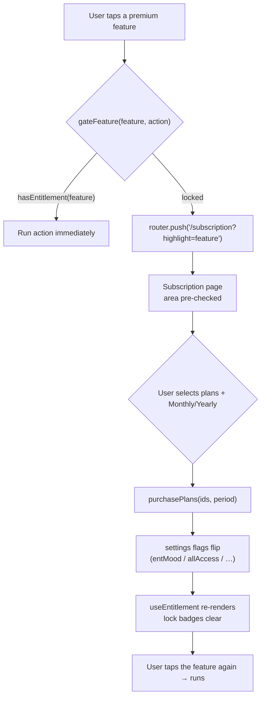
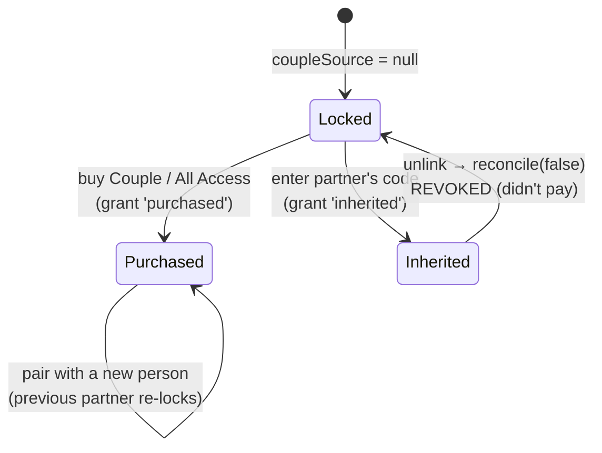
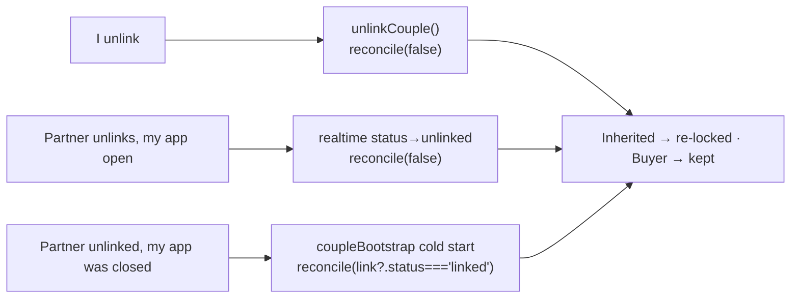
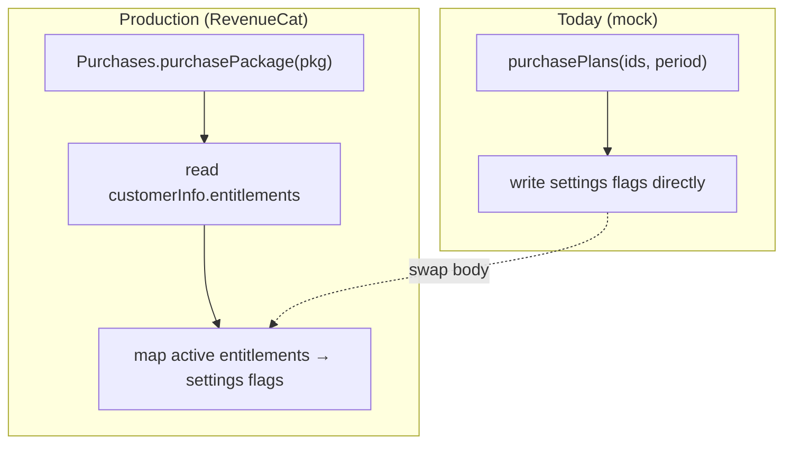

# Subscription & Premium Architecture

How the paywall works in Kawaii Baby Wallpapers — the entitlement model, the
four premium areas, the gate flow, the couple buyer/partner rule, and the seam
where real billing (RevenueCat / Play Billing) plugs in.

> Wired in **changes/158**. Today purchases are a **local mock** — "Subscribe"
> flips persisted flags. The read path and every gate call site are already
> production-shaped, so going live touches only the write path.

---

## 1. What's premium

Four **independently-purchasable** areas, plus an **All Access** bundle that
grants all four at once. The user can buy any subset à la carte, billed
**Monthly or Yearly**.

| Area (`PlanId`) | Entitlement flag | What it unlocks | What stays free |
|---|---|---|---|
| `themePacks` | `entThemePacks` | Custom shuffle albums, 15 / 30 / custom timers, Smart-time mode | Default packs, 1h/6h/12h/24h timers, 1 free custom album |
| `mood` | `entMood` | All Mood-based features (auto mood wallpaper, background/sleep-wake/friend, extra mood pools) | — (mood is fully premium) |
| `collection` | `entCollection` | Applying any of the 60 Premium-collection wallpapers | Browsing/previewing them; all non-premium wallpapers |
| `couple` | `isCouplePremium` | Generating a couple code (couple theme + proximity) | Browsing couple packs |
| `allAccess` | `allAccess` | Everything above | — |

`Free vs premium` for theme-pack timers/modes is data-driven in
`constants/shuffle.ts` (`TIMER_OPTIONS`, `SHUFFLE_MODES` carry a `premium`
flag). The premium-collection ids are `premium-<uuid>` (`constants/premiumCatalog.ts`).

---

## 2. The entitlement model

All entitlement state lives in `store/settings.ts` (persisted to AsyncStorage,
`@kawaii/settings@v1`, schema v3):

```
allAccess        : boolean                              // bundle — grants all four
entThemePacks    : boolean
entMood          : boolean
entCollection    : boolean
isCouplePremium  : boolean                              // couple area (legacy name)
coupleSource     : 'purchased' | 'inherited' | null     // WHY couple is held → unlink rule
billingPeriod    : 'monthly' | 'yearly'                 // display only (mock)
```

A v2→v3 migration maps any pre-existing single `isPremium: true` onto the three
non-couple flags, and treats a held `isCouplePremium` as `'purchased'` so
upgrading testers aren't re-locked.

**The single read path** is `lib/billing.ts`:

```
hasEntitlement(feature)   // imperative — background tasks, bootstrap, handlers
useEntitlement(feature)   // reactive hook — components that re-render on subscribe
hasCouplePremium()        // alias for hasEntitlement('couple')
```

Both combine the enforce/testing switch with the flags:

```
hasEntitlement(f) = !SUBSCRIPTIONS_ENABLED        // testing → everything unlocked
                 || allAccess                     // bundle
                 || <the feature's flag>          // à la carte
```

---

## 3. Gate flow — tapping a locked feature

Every premium gate calls `gateFeature(feature, onUnlock)` (`components/PremiumLock.tsx`).
If entitled it runs the action; otherwise it routes to the subscription page
with that area pre-highlighted. After subscribing, the user taps the feature
again (the deferred action is **not** auto-resumed across navigation — standard
paywall behaviour).



**Call sites** (all migrated in changes/158):

| Area | Where gated |
|---|---|
| `themePacks` | `app/wallpapers/theme-packs.tsx` (custom album), `app/theme-pack/[id].tsx` + `app/shuffle/[id].tsx` (premium timers/modes) |
| `mood` | `app/(tabs)/mood.tsx` (5 toggles), `app/mood/camera.tsx`, `hooks/usePickCollection.tsx` |
| `collection` | `app/wallpaper/[id].tsx` (apply) |
| `couple` | `app/couple/setup.tsx` (generate code) via `gateCouplePremium`, also enforced server-adjacent in `lib/couple.createCoupleCode` |

---

## 4. Couple theme — buyer vs partner (the special rule)

Couple is **one subscription that unlocks one partner at a time**. The buyer
shares a `LOVE-XXXX` code; the partner who enters it unlocks couple **for free
while linked**, but is **re-locked the moment the pair ends**. Only the buyer
keeps it. `coupleSource` records which side you are.



Mechanics (`lib/billing.ts`):

- `grantCoupleEntitlement('inherited' | 'purchased')` — sets `isCouplePremium`
  and records the source. **Never downgrades** a purchase to inherited (a buyer
  who also accepts a code stays `'purchased'`).
- `reconcileCoupleEntitlement(isLinked)` — on unlink: All Access / `'purchased'`
  → kept; `'inherited'` → `isCouplePremium=false`, `coupleSource=null`.

Source is assigned by **role**: the creator generated the code (they needed the
entitlement to do so → `'purchased'`); the accepter inherited (`'inherited'`).
This survives reinstall because `lib/couple.hydration.ts` re-derives it from
`isCreator` on every hydrate.

The revoke runs at **three** points so both phones converge:



---

## 5. Enforcement switch + dev unlock

`constants/billing.ts`:

```
SUBSCRIPTIONS_ENABLED = true   // ENFORCED (default): gates lock, route to paywall
                      = false  // TESTING: hasEntitlement returns true for all
```

A `__DEV__`-only **"Dev: unlock All Access"** button on the subscription page
(`lib/billing.devUnlockAll`) grants the bundle for free, so QA can still
exercise every gated flow without a store sandbox.

---

## 6. The RevenueCat seam

Going live changes **only the write path** — no gate call site, no read path,
no entitlement shape changes.



To wire it:

1. Add `react-native-purchases`; configure products for the 4 areas + All
   Access (monthly + yearly) in Play Console / App Store Connect.
2. Replace the body of `purchasePlans` with `Purchases.purchasePackage`, then
   set the flags from `customerInfo.entitlements.active`.
3. On boot, refresh flags from `getCustomerInfo()` (handles renewals / lapses /
   cross-device restore). Read prices from the offering instead of the
   placeholders in `constants/plans.ts`.
4. Set `SUBSCRIPTIONS_ENABLED = true` (already the default) and remove the dev
   unlock button.

---

## 7. File map

| Concern | File |
|---|---|
| Entitlement flags + migration | `store/settings.ts` |
| Entitlement API + grant/reconcile/purchase | `lib/billing.ts` |
| Enforce/testing switch | `constants/billing.ts` |
| Plan catalog + placeholder prices | `constants/plans.ts` |
| Gate helper (`gateFeature`) + lock badge | `components/PremiumLock.tsx` |
| Subscription page | `app/subscription.tsx`, `components/subscription/*` |
| Settings entry point | `app/(tabs)/profile.tsx` ("Subscription" section) |
| Couple grant/revoke wiring | `lib/couple.ts`, `lib/couple.hydration.ts`, `lib/couple.realtime.ts`, `lib/coupleBootstrap.ts` |
| Tests | `lib/__tests__/billing.test.ts` |
