# Subscription Model — Full Diagrams

A complete visual walkthrough of how the subscription/premium system works
(changes/158). Diagram-first; for the prose reference see
[`SUBSCRIPTION_ARCHITECTURE.md`](./SUBSCRIPTION_ARCHITECTURE.md).

All diagrams are Mermaid — they render on GitHub and in most Markdown viewers.

---

## 0. What's premium

Four independently-buyable areas + an All Access bundle. Each maps to one
persisted flag in `store/settings.ts`.

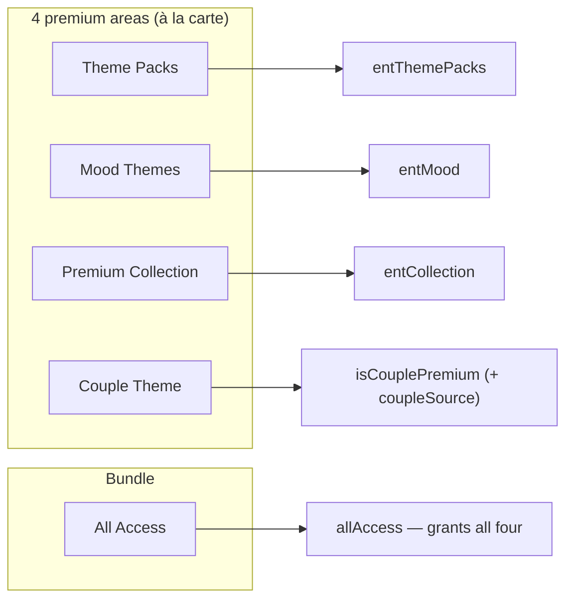

| Area | Flag | Premium part | Free part |
|---|---|---|---|
| Theme Packs | `entThemePacks` | custom albums, 15/30/custom timers, smart shuffle | default packs, 1h–24h timers, 1 free album |
| Mood Themes | `entMood` | every mood feature | — |
| Premium Collection | `entCollection` | applying the 60 wallpapers | browsing them |
| Couple Theme | `isCouplePremium` | generating a couple code | browsing couple packs |
| All Access | `allAccess` | all of the above | — |

---

## 1. System map — the whole model on one page

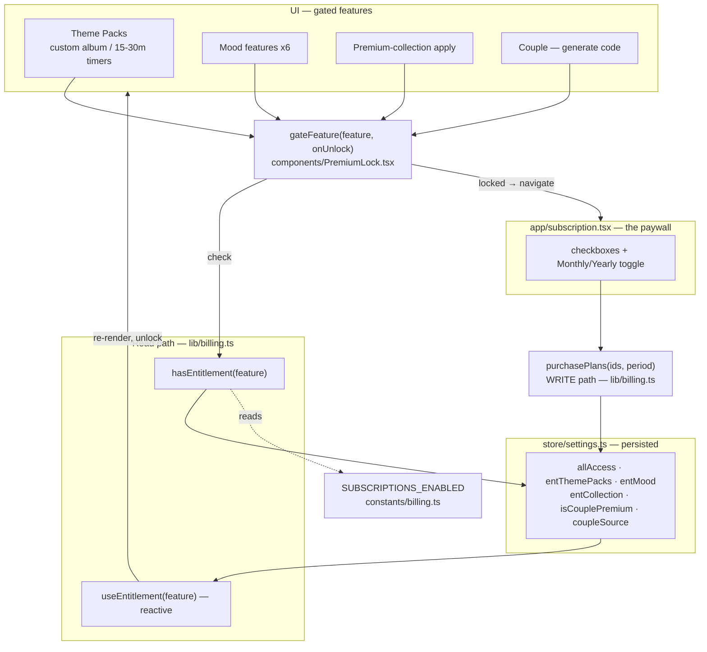

---

## 2. Gate decision — what `hasEntitlement` returns

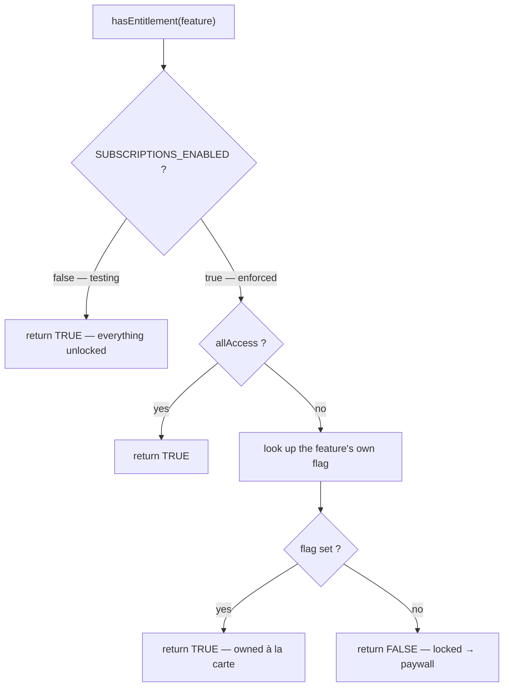

---

## 3. Tap-to-unlock flow (sequence)

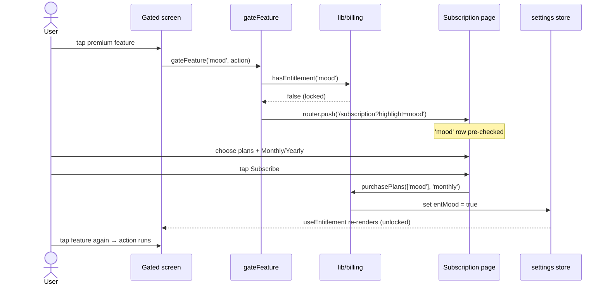

> The deferred action is **not** auto-resumed across navigation — after
> subscribing the user taps the feature again. This matches every store paywall.

---

## 4. Purchase → which flags flip

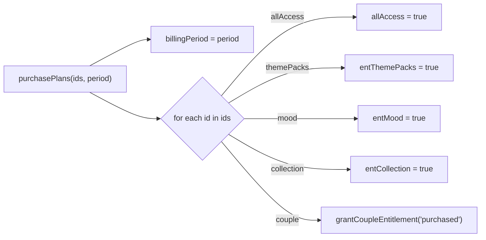

---

## 5. Couple Theme — the buyer/partner rule

One subscription unlocks **one partner at a time**. The buyer shares a
`LOVE-XXXX` code; the partner unlocks for free **while linked**, then is
**re-locked on unlink**. `coupleSource` records which side you are.

### 5a. State machine

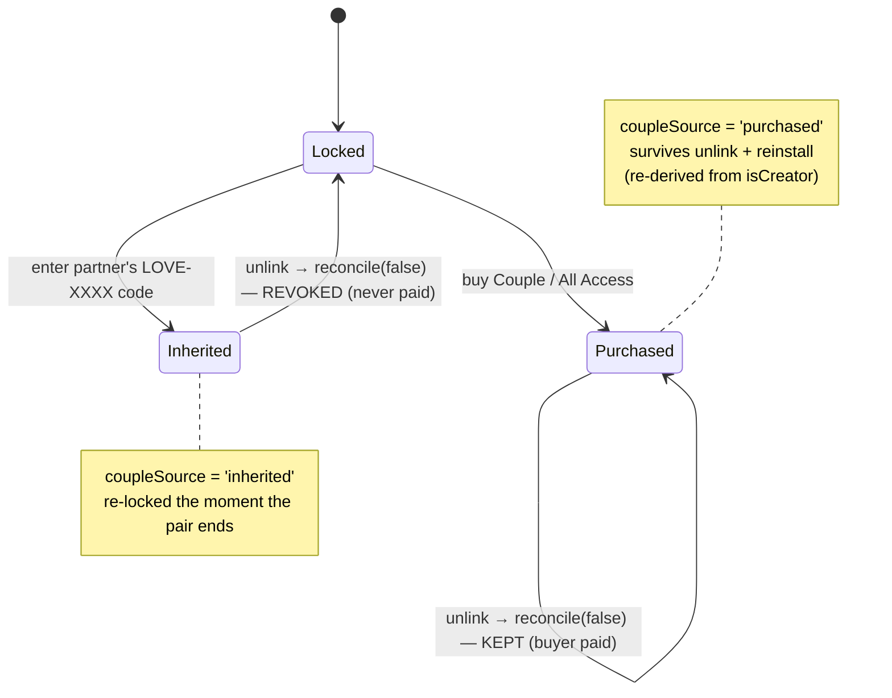

### 5b. Two devices end-to-end

```mermaid
sequenceDiagram
    actor B as Buyer (creator)
    participant DB as Supabase
    actor P as Partner (accepter)

    B->>B: purchasePlans(['couple']) → coupleSource = 'purchased'
    B->>DB: create_couple() → LOVE-XXXX  (requires entitlement)
    B-->>P: shares the code
    P->>DB: accept_couple_code(LOVE-XXXX)
    DB-->>P: linked
    P->>P: grantCoupleEntitlement('inherited')
    Note over B,P: both unlocked while linked

    rect rgb(40,30,30)
    Note over B,P: later — someone unlinks
    B->>DB: unlink_couple()
    B->>B: reconcile(false) → 'purchased' KEPT
    DB-->>P: realtime: status = unlinked
    P->>P: reconcile(false) → 'inherited' REVOKED
    end
```

### 5c. The revoke fires at three points (so both phones converge)

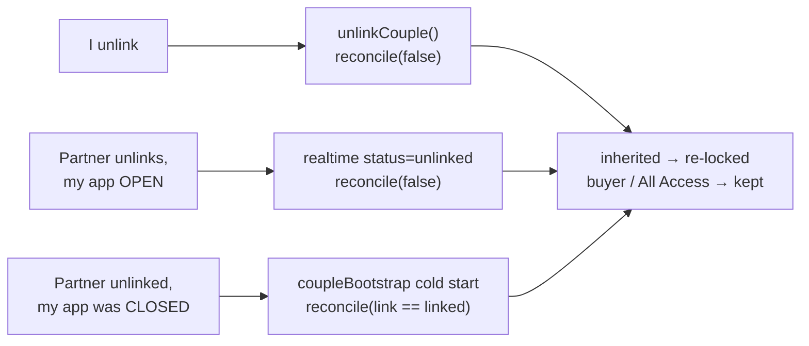

---

## 6. Enforcement + dev unlock

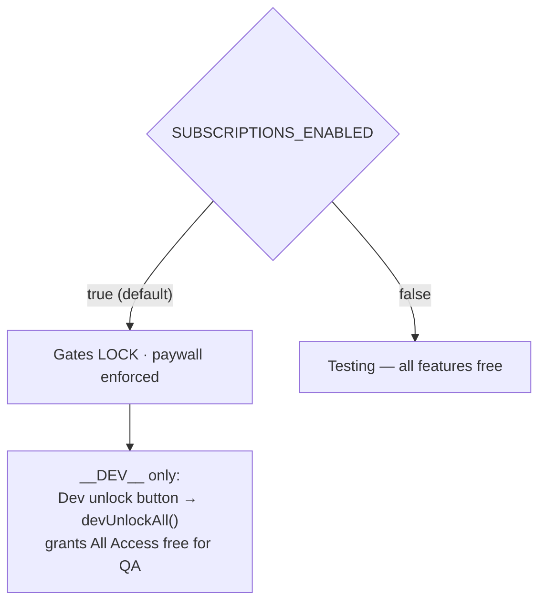

---

## 7. RevenueCat seam — going live changes one function

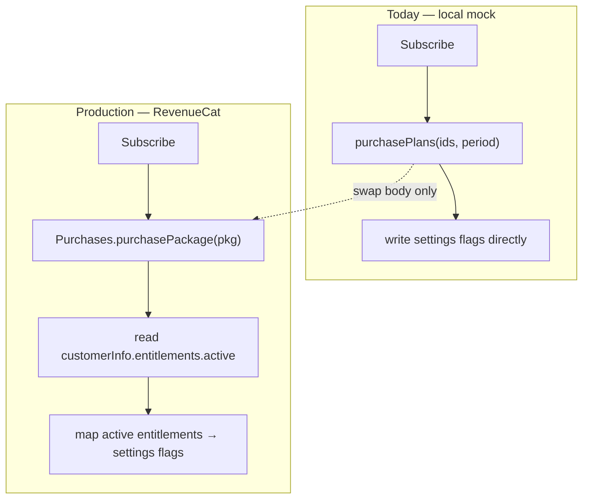

The read path (`hasEntitlement` / `useEntitlement`), every gate call site, the
flag shape, and the subscription page all stay identical.

---

## 8. File map

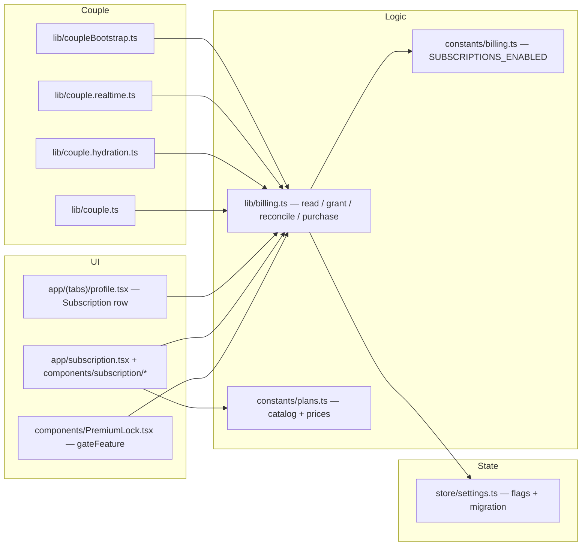
